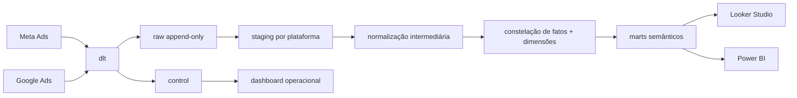

# Estudo de arquitetura — skill de IA para warehouse de mídia paga

**Data da pesquisa:** 10 de julho de 2026

**Escopo:** Meta Ads + Google Ads → PostgreSQL → dbt Core → Looker Studio / Power BI
**Objetivo:** definir como construir uma skill confiável, econômica e tecnicamente profunda para projetar, implementar, auditar e evoluir bancos de dados de mídia paga.

## 1. Resumo executivo

> **Decisão arquitetural atualizada em 10 de julho de 2026:** esta skill é global e dlt-first. Ela deve usar dlt em projetos novos, extensões e migrações e não deve sugerir Airbyte ou PyAirbyte como alternativas. As comparações com Airbyte mantidas neste estudo são registro da pesquisa que levou à decisão, não opções oferecidas pela skill.

A skill ideal não deve ser um grande prompt que “sabe tudo”. Ela deve ser um pequeno sistema operacional de engenharia de dados composto por:

1. um `SKILL.md` curto, que determina o fluxo de trabalho e os critérios de decisão;
2. referências versionadas, separadas por Meta, Google, modelagem, métricas, dbt, BI, operação e segurança;
3. scripts determinísticos que validam configuração, grain, chaves, contratos, SQL e resultados;
4. templates de projeto que a skill copia e adapta;
5. uma suíte de cenários de avaliação que prova se a skill sabe construir, diagnosticar e auditar — não apenas explicar.

A arquitetura de dados recomendada para o início é:



As cinco decisões mais importantes são:

- Usar PostgreSQL como warehouse inicial é razoável, mas o “data lake” será uma zona raw lake-like dentro do banco, não um data lake de objetos ilimitado.
- Usar dlt como motor global de ingestão. A skill escolhe entre verified sources, REST API source e recursos customizados dlt, sem oferecer Airbyte/PyAirbyte como alternativa.
- Usar `fivetran/dbt_ad_reporting` como referência sem presumir compatibilidade: os contratos raw produzidos por dlt precisam de modelos de staging/adaptação próprios.
- Modelar uma constelação de fatos por grain; nunca uma única tabela universal contendo todas as breakdowns.
- Expor uma tabela/view larga por caso de uso de BI, não uma “One Big Table” para todas as perguntas.

## 2. O que a skill deve fazer

### 2.1 Capacidades obrigatórias

A skill deve conseguir operar em quatro modos:

| Modo | Entrada | Saída |
|---|---|---|
| Planejar | volume, contas, fontes, BI, SLA, orçamento | arquitetura, ADRs, grains, contratos e roadmap |
| Construir | repositório e requisitos aprovados | ingestão, DDL, dbt, testes, roles e views BI |
| Auditar | repositório ou banco existente | achados priorizados com evidência e impacto |
| Diagnosticar | erro, logs, run IDs, discrepância | causa raiz, escopo afetado e correção proposta |

Ela precisa dominar:

- autenticação, versionamento, paginação, quotas, retries e backoff;
- backfill, incremental, lookback de conversão, idempotência e replay;
- grains e compatibilidade de fields/metrics/breakdowns;
- PostgreSQL analítico, particionamento, índices, materialized views e segurança;
- dbt Core: sources, staging, intermediate, marts, snapshots, incrementais, contracts, tests, exposures e documentação;
- Kimball/star schema e fact constellation;
- semântica de mídia: funil, métricas, atribuição, moeda, fuso, pacing e qualidade;
- contratos específicos de Looker Studio e Power BI;
- observabilidade operacional separada do reporting de negócio.

### 2.2 Limites explícitos da primeira versão

A versão 1 deve ser read-only em relação às contas de anúncios. Ela pode construir pipelines, consultar dados e recomendar investigações, mas não deve:

- pausar campanhas;
- alterar orçamento ou lance;
- criar anúncios;
- modificar tracking;
- executar uma recomendação sem aprovação humana.

Essas ações exigem outra skill, permissões separadas e checkpoints de confirmação.

## 3. Como construir a skill corretamente

### 3.1 Nome proposto

`build-paid-media-warehouse`

O nome é curto, verbal e descreve a principal ação. A descrição do frontmatter deve incluir todos os gatilhos relevantes, pois ela é o mecanismo de ativação.

Exemplo de frontmatter futuro:

```yaml
---
name: build-paid-media-warehouse
description: Project, build, audit, and troubleshoot PostgreSQL data warehouses for Meta Ads and Google Ads using Airbyte or PyAirbyte, dbt Core, dimensional modeling, semantic marts, and dashboard-ready contracts for Looker Studio and Power BI. Use when Codex needs to plan Ads ingestion, implement raw/staging/marts layers, normalize cross-platform marketing metrics, validate attribution and grain, optimize PostgreSQL for BI, or diagnose paid-media data quality and pipeline failures.
---
```

### 3.2 Estrutura proposta

```text
build-paid-media-warehouse/
├── SKILL.md
├── agents/
│   └── openai.yaml
├── references/
│   ├── architecture.md
│   ├── meta-ads-ingestion.md
│   ├── google-ads-ingestion.md
│   ├── postgres-warehouse.md
│   ├── dimensional-model.md
│   ├── metrics-and-attribution.md
│   ├── dbt-patterns.md
│   ├── bi-contracts.md
│   ├── operations-and-security.md
│   └── source-compatibility.md
├── scripts/
│   ├── inspect_project.py
│   ├── validate_config.py
│   ├── validate_grain.py
│   ├── validate_metric_catalog.py
│   ├── compare_source_to_mart.py
│   ├── profile_postgres.py
│   └── scaffold_project.py
└── assets/
    └── postgres-dbt-template/
        ├── dbt_project.yml
        ├── packages.yml
        ├── models/
        ├── seeds/
        └── sql/
```

Não criar `README.md`, changelog ou guias paralelos dentro da skill. A documentação necessária ao agente fica em `SKILL.md` e `references/`. Histórico do projeto pode ser mantido no Git.

### 3.3 O que fica no `SKILL.md`

O arquivo principal deve conter somente o procedimento transversal:

1. classificar a solicitação em planejar, construir, auditar ou diagnosticar;
2. inspecionar o repositório e o banco antes de assumir uma arquitetura;
3. coletar as restrições que não podem ser descobertas: contas, SLA, histórico, moedas, fusos, BI e política de conversão;
4. declarar grains e contratos antes de escrever SQL;
5. escolher o adaptador de ingestão com uma matriz explícita;
6. construir da camada `control/raw` até `semantic`, sem pular reconciliação;
7. validar configuração, compilação dbt, testes, reconciliação, performance e acesso BI;
8. entregar evidências, limitações e decisões.

O `SKILL.md` deve apontar diretamente para cada referência e dizer quando lê-la. Referências não devem ficar aninhadas em vários níveis.

### 3.4 Graus de liberdade

| Tema | Liberdade | Regra |
|---|---|---|
| Grain, chaves, moeda, fuso, atribuição e segurança | Baixa | exigir contratos e validações determinísticas |
| Estratégia incremental e materialização | Média | escolher conforme volume, mutabilidade e SLA |
| Airbyte Core versus PyAirbyte/Dagster | Média | usar matriz de maturidade e custo operacional |
| Métricas e marts específicos do negócio | Alta | adaptar a objetivo, funil e operação do cliente |
| Ações em contas de anúncios | Nenhuma na v1 | read-only e aprovação humana |

### 3.5 `agents/openai.yaml`

Proposta:

```yaml
interface:
  display_name: "Paid Media Warehouse"
  short_description: "Build reliable Ads data warehouses"
  default_prompt: "Use $build-paid-media-warehouse to design a PostgreSQL warehouse for Meta Ads and Google Ads."

policy:
  allow_implicit_invocation: true
```

Não declarar um MCP como dependência obrigatória. A skill precisa funcionar sobre arquivos, dbt e PostgreSQL. MCPs de Ads ou banco entram como adaptadores opcionais quando disponíveis.

### 3.6 Scripts determinísticos

| Script | Responsabilidade | Falha quando |
|---|---|---|
| `inspect_project.py` | inventariar stack, schemas, modelos e versões | faltam artefatos esperados |
| `validate_config.py` | validar contas, datas, moedas, fusos, secrets por referência | segredo aparece em arquivo versionado ou config incompleta |
| `validate_grain.py` | comparar grain declarado com unicidade real | chave composta duplica ou contém nulos |
| `validate_metric_catalog.py` | validar fórmula, aditividade, denominador e unidade | métrica não tem definição operacional |
| `compare_source_to_mart.py` | reconciliar totais por conta/data/plataforma | diferença supera tolerância declarada |
| `profile_postgres.py` | coletar tamanho, cardinalidade, planos e índices | detectar scan/latência fora do orçamento |
| `scaffold_project.py` | gerar estrutura segura a partir do template | destino já contém arquivos conflitantes |

### 3.7 Avaliação da skill

A skill só deve ser considerada pronta depois de resolver cenários independentes:

1. projetar um warehouse novo com duas contas Meta e duas Google;
2. detectar duplicação causada por breakdown incorporado ao grain errado;
3. explicar uma divergência de conversões causada por lookback/atribuição;
4. adaptar dados Airbyte para um mart inspirado no Fivetran sem afirmar compatibilidade inexistente;
5. preparar views para Looker Studio respeitando limites do conector;
6. preparar Power BI Import com refresh incremental e query folding;
7. impedir soma de moedas diferentes;
8. impedir média de CTR/CPA e recalcular razões de somas;
9. detectar que a conta manager Google foi usada para uma query de métricas inválida;
10. provar isolamento de clientes com role/RLS.

Cada cenário precisa de entrada, resultado esperado, checks objetivos e um conjunto pequeno de fixtures.

## 4. Arquitetura PostgreSQL proposta

### 4.1 Schemas

| Schema | Conteúdo | Quem escreve |
|---|---|---|
| `control` | clientes, contas, conexões, runs, cursores, contratos, SLAs | orquestrador |
| `raw_meta` | payloads/eventos Meta append-only | ingestão |
| `raw_google` | payloads/eventos Google append-only | ingestão |
| `stg_meta` | tipos, nomes e deduplicação mínima Meta | dbt |
| `stg_google` | tipos, micros, nomes e deduplicação mínima Google | dbt |
| `intermediate` | normalização, identidade, moeda e taxonomia | dbt |
| `analytics` | dimensões e fatos conformados | dbt |
| `semantic` | marts/views dashboard-ready | dbt |
| `ops` | frescor, runs, erros, reconciliação e custo | ingestão + dbt |

### 4.2 Plano de controle

Tabelas mínimas:

```text
control.tenants
control.ad_connections
control.ad_accounts
control.extraction_contracts
control.sync_runs
control.stream_state
control.backfill_requests
control.metric_policies
control.currency_policies
control.data_quality_results
```

Campos indispensáveis por conta:

- `tenant_id`;
- `platform`;
- `account_id` e `manager_account_id` quando aplicável;
- `account_timezone`;
- `currency_code`;
- `enabled`;
- `collection_tier`;
- `start_date`;
- `conversion_lookback_days`;
- referência ao secret, nunca o secret;
- versão do contrato de extração.

### 4.3 Raw lake-like em PostgreSQL

Como o Direct Load atual da Airbyte não garante a antiga raw table JSON como padrão, criar um envelope próprio quando replay/auditoria forem requisitos:

```text
tenant_id
platform
account_id
stream_name
api_version
connector_name
connector_version
contract_version
report_date_local
source_primary_key jsonb
payload jsonb
payload_hash
extracted_at timestamptz
run_id
ingestion_date
```

Regras:

- append-only;
- `payload_hash` + chave da origem + `extracted_at` para rastreabilidade;
- nunca transformar silenciosamente o payload raw;
- particionar por `ingestion_date` somente quando volume/manutenção justificarem;
- política explícita de retenção e backup;
- dados sensíveis e tokens ficam fora do payload.

PostgreSQL deixa de ser adequado como raw lake quando retenção, volume, replay e custo de storage/backup tornam JSONB operacionalmente caro. O gatilho deve ser medido por tamanho, tempo de backup/restore, duração de vacuum, latência e crescimento, não por moda arquitetural. Nesse ponto, mover somente raw histórico para object storage/Parquet e conservar PostgreSQL como warehouse.

## 5. Ingestão e APIs

### 5.1 Matriz de ferramentas

| Opção | Melhor uso | Vantagens | Limitações | Recomendação |
|---|---|---|---|---|
| dlt | pipelines Python code-first e APIs customizadas | leve, normalização aninhada, merge, estado, schema evolution/contracts | operação, testes e conectores customizados ficam sob responsabilidade do projeto | padrão do `datawarehouse-RFM` |
| PyAirbyte | protótipo greenfield e poucas contas | Python, conectores existentes, estado incremental, Postgres cache | exige código operacional e disciplina de raw/observabilidade | alternativa para projetos novos |
| Airbyte Core | várias conexões e operação via UI | gestão de conectores, schedules, catálogo e logs | Kubernetes, 8 GB sugeridos, upgrades e custo operacional | fase de escala |
| Dagster + PyAirbyte | equipe code-first e SLAs | assets, retries, schedules, lineage e integração dbt | mais componentes e manutenção | alternativa de escala |
| SDK/API própria | requisito não coberto pelo conector | controle total | maior manutenção e risco de quebra por versão | exceção justificada |
| MCP de Ads | consulta agentic ao vivo | exploração e diagnóstico por IA | não é ETL durável nem estado/replay | opcional, read-only |

### 5.2 Programação

Stack de referência:

- Python 3.12+;
- configuração tipada e validada;
- secrets via variáveis/secret manager;
- SQL/dbt para transformação;
- `psycopg`/SQLAlchemy apenas no plano de controle e carga própria;
- logs JSON com `run_id`, conta, stream, janela, tentativas, linhas e duração;
- retry exponencial com jitter somente em erros transitórios;
- dead-letter/erro persistido para falhas de registro;
- CLI idempotente para `discover`, `backfill`, `sync`, `transform`, `reconcile` e `serve-ops`.

Fluxo de execução:

```text
discover accounts
→ validate contract
→ create sync run
→ extract by account/stream/window
→ persist raw/direct-load boundary
→ close extraction run
→ dbt build by affected dates/accounts
→ reconcile source vs marts
→ publish freshness/quality
```

### 5.3 Meta Ads

Contratos separados por grain:

- inventário: accounts, campaigns, ad sets, ads, creatives;
- performance base: dia × conta × campanha × ad set × anúncio;
- ações: performance base × `action_type` × janela/atribuição quando disponível;
- delivery: performance base × publisher/placement/device;
- demografia/geografia: fatos próprios por breakdown.

Cuidados obrigatórios:

- validar compatibilidade de fields, breakdowns e action breakdowns;
- usar jobs assíncronos para relatórios grandes;
- usar fuso da conta para datas de Insights;
- configurar lookback coerente com a atribuição, até o limite suportado;
- incluir status arquivados quando o objetivo é inventário completo;
- preservar arrays de ações no raw e explodi-los em fato próprio;
- registrar nível solicitado e composição da chave de deduplicação.

### 5.4 Google Ads

Contratos GAQL separados:

- conta e hierarquia manager/client;
- dimensões: campaign, ad group, ad, asset, criterion e conversion action;
- performance diária comum;
- search term/keyword;
- device/network/geo em fatos separados;
- conversões por interaction date;
- conversões por conversion date, separadas ou marcadas por `date_basis`.

Cuidados obrigatórios:

- manager accounts servem para descoberta/hierarquia; métricas normalmente são extraídas nas contas cliente;
- cada `FROM` e segmento define o grain e a compatibilidade;
- cada segmento adicional pode multiplicar linhas;
- converter `cost_micros` dividindo por 1.000.000 e preservar o inteiro bruto;
- usar janela móvel de conversão e conservar `extracted_at`;
- tratar 37 meses como retenção granular atual, sem congelar o número na lógica da skill;
- consultas diárias não retornam necessariamente linhas zeradas;
- usar change status para dimensões, com reconciliação/full refresh periódico.

### 5.5 Versionamento

Nenhuma versão de API, conector ou pacote deve ficar apenas em texto narrativo. Manter um manifesto versionado:

```yaml
contracts:
  meta_campaign_daily:
    platform: meta
    connector: airbyte-facebook-marketing
    connector_version: "pinned-range"
    level: campaign
    grain: [tenant_id, account_id, report_date_local, campaign_id]
  google_campaign_daily:
    platform: google_ads
    connector: airbyte-google-ads
    api_version: "configured"
    resource: campaign
    grain: [tenant_id, customer_id, segments_date, campaign_id]
```

Atualizações passam por CI: discover/schema diff → compile → unit tests → fixture regression → staging sync → reconciliação → promoção.

## 6. Modelagem dimensional e blending

### 6.1 Princípio: constelação de fatos

Um star schema não significa uma tabela única. Meta e Google têm grains e métricas que não podem ser combinados sem perda semântica.

Dimensões conformadas:

```text
dim_date
dim_tenant
dim_platform
dim_ad_account
dim_campaign
dim_ad_group
dim_ad
dim_creative
dim_conversion_action
dim_currency
dim_geo
dim_device
dim_placement
```

Fatos recomendados:

```text
fct_campaign_performance_daily
fct_ad_performance_daily
fct_conversion_action_daily
fct_delivery_breakdown_daily
fct_geo_performance_daily
fct_search_term_daily
fct_budget_snapshot_daily
fct_entity_change
```

### 6.2 Grain declarado

Todo fato precisa documentar:

- uma frase “uma linha representa...”;
- chave natural/composta;
- dimensões degeneradas;
- métricas aditivas, não aditivas e derivadas;
- base temporal;
- moeda;
- política de atualização;
- testes de unicidade e not-null.

Exemplo:

> Uma linha de `fct_campaign_performance_daily` representa a observação mais recente das métricas de uma campanha, em uma conta e plataforma, para um dia no fuso da conta, sem breakdown adicional, na moeda local da conta.

### 6.3 Identidade e histórico

- IDs de plataformas só são únicos dentro do namespace correto; sempre incluir `platform` e `account_id` na chave de negócio.
- Nomes, status, objetivo e orçamento mudam. Usar snapshots/SCD2 somente quando a pergunta histórica exige “como estava na época”.
- Para reporting comum, fatos devem carregar as chaves e dimensões atuais podem fornecer nomes; para auditoria histórica, manter versão efetiva.
- Criar surrogate keys determinísticas, mas conservar IDs nativos.

### 6.4 Moeda

Nunca somar gasto de contas em moedas diferentes.

Campos:

```text
currency_code
spend_micros_raw       -- quando Google
spend_local
fx_rate
fx_rate_date
fx_rate_source
reporting_currency
spend_reporting_currency
```

O dashboard deve permitir escolher `local` ou `reporting currency`; totais cross-account só ficam habilitados quando a política de conversão estiver completa.

### 6.5 Tempo e atribuição

Conservar:

```text
report_date_local
account_timezone
date_basis             -- interaction | conversion | mixed | platform_default
attribution_window
attribution_model
extracted_at_utc
transformed_at_utc
```

Não “converter” uma data diária pré-agregada para UTC como se fosse timestamp de evento. A data é uma chave civil no fuso da conta.

### 6.6 Métricas

| Classe | Exemplos | Agregação |
|---|---|---|
| Aditiva | gasto, impressões, cliques, conversões sob mesma política | `sum` |
| Razão derivada | CTR, CPC, CPM, CPA, ROAS, CVR | razão das somas |
| Semi/não aditiva | alcance, frequência, impression share, médias | regra específica ou não agregar |
| Mutável | conversões, valor, leads atribuídos | upsert em janela móvel/snapshot |
| Específica | ações Meta, termos Google, vídeo | fatos/marts próprios |

Fórmulas semânticas:

```sql
ctr  = sum(clicks)::numeric / nullif(sum(impressions), 0)
cpc  = sum(spend) / nullif(sum(clicks), 0)
cpm  = 1000 * sum(spend) / nullif(sum(impressions), 0)
cpa  = sum(spend) / nullif(sum(conversions), 0)
roas = sum(conversion_value) / nullif(sum(spend), 0)
```

Cada métrica precisa de owner, descrição, unidade, grain permitido, filtros, numerador, denominador, política de nulo e compatibilidade cross-platform.

## 7. Estrutura dbt

```text
dbt/
├── dbt_project.yml
├── packages.yml
├── macros/
├── models/
│   ├── sources/
│   ├── staging/
│   │   ├── meta/
│   │   └── google_ads/
│   ├── intermediate/
│   ├── analytics/
│   │   ├── dimensions/
│   │   └── facts/
│   ├── semantic/
│   └── ops/
├── seeds/
├── snapshots/
└── tests/
```

### 7.1 Convenções

- `src_*`: sources e freshness;
- `stg_*`: 1:1 lógico com a fonte, renomear/tipar/deduplicar;
- `int_*`: joins e normalizações reutilizáveis;
- `dim_*` e `fct_*`: modelos dimensionais;
- `rpt_*`: contratos de consumo;
- `ops_*`: qualidade e prontidão.

### 7.2 Materializações

| Camada | Padrão | Exceção |
|---|---|---|
| staging | view | table quando fonte/parse for caro |
| intermediate | ephemeral/view | table para reuso caro |
| facts | incremental table | full table em volume pequeno |
| dimensions | table/snapshot | view para dimensões triviais |
| semantic | view | materialized view para consulta cara |
| ops | table/incremental | view para estado corrente |

Fatos mutáveis usam janela móvel e `unique_key` composto. Mudança de lógica histórica exige `--full-refresh` controlado e reconciliação.

### 7.3 Pacotes

Usar de forma seletiva:

- `dbt_utils` para surrogate keys e testes/macros comuns;
- pacotes Fivetran somente quando os schemas de fonte correspondem aos contratos Fivetran;
- `dbt_ad_reporting` como referência de padronização e outputs, com pin de versão e avaliação de licença;
- evitar adicionar pacote apenas por conveniência se ele trouxer várias plataformas e dependências desnecessárias.

### 7.4 Testes mínimos

```text
source freshness
not_null nas chaves
unique no grain composto
relationships entre fato e dimensões
accepted_values para platform/date_basis/currency
métricas >= 0 quando semanticamente aplicável
spend_micros / 1e6 consistente
CTR/CPC/CPA derivados e não persistidos da média
reconciliação por conta + data + plataforma
ausência de fanout entre fatos
RLS/roles por tenant
```

Contratos dbt ficam nos modelos `semantic.rpt_*`, pois são APIs de dados para dashboards.

## 8. Dashboard-ready

### 8.1 Não criar uma OWT universal

Criar uma tabela/view larga por pergunta:

| Mart | Grain | Uso |
|---|---|---|
| `rpt_paid_media_overview_daily` | dia × conta × plataforma | visão executiva |
| `rpt_campaign_performance_daily` | dia × campanha | otimização e comparação |
| `rpt_creative_performance_daily` | dia × anúncio/criativo | fadiga e rotação |
| `rpt_conversion_actions_daily` | dia × ação de conversão | qualidade e atribuição |
| `rpt_search_terms_daily` | dia × termo/keyword | desperdício e intenção |
| `rpt_budget_pacing_daily` | dia × campanha | over/under delivery |
| `rpt_delivery_breakdown_daily` | dia × placement/device | diagnóstico de entrega |

Esses contratos evitam joins no BI sem misturar grains incompatíveis.

### 8.2 Looker Studio

O conector PostgreSQL atual:

- conecta diretamente a uma tabela;
- exige custom query para schemas fora de `public`;
- limita consultas a 150 mil linhas;
- exige nomes de campos ASCII.

Implicações:

- expor views estreitas, agregadas e filtráveis;
- considerar um schema `semantic` via custom query ou aliases controlados em `public`;
- não enviar raw/fato granular ilimitado ao Looker Studio;
- índices devem começar pelos filtros mais frequentes: `tenant_id`, `report_date_local`, `platform`, `account_id`;
- usar materialized views quando o plano da view for caro e a latência aceitar defasagem.

### 8.3 Power BI

Para Import + refresh incremental:

- disponibilizar coluna `date/time` compatível com `RangeStart` e `RangeEnd`;
- garantir query folding até o PostgreSQL;
- evitar transformações M que puxem a tabela completa;
- usar gateway enterprise/padrão quando o banco não for diretamente acessível;
- avaliar DirectQuery/composite apenas quando volume e latência justificarem;
- criar agregações para reduzir consultas em DirectQuery.

### 8.4 Camada semântica barata

MVP:

- views/materialized views PostgreSQL;
- dicionário versionado de métricas;
- fórmulas derivadas no SQL;
- contratos dbt;
- medidas DAX/Looker calculadas apenas quando forem apresentação, não regra central.

Opcional posterior:

- dbt Semantic Layer/MetricFlow;
- Cube ou outra camada semântica;
- exports de métricas materializados no warehouse.

## 9. Como gestores e analistas olham os dados

A skill precisa começar pela pergunta, não pela tabela.

### 9.1 Saúde e anomalias

- O gasto ou volume mudou fora do padrão 7/14/30 dias?
- A queda veio de entrega, clique, conversão ou valor?
- É mudança real ou dado incompleto/atrasado?
- A anomalia está concentrada em plataforma, conta, campanha, placement, device ou criativo?

Dados necessários: baseline, frescor, completude, calendário comparável e decomposição do funil.

### 9.2 Orçamento e desperdício

- Quanto deveria ter sido gasto até hoje?
- Quanto foi gasto e qual a projeção até o fim do período?
- Quais campanhas consomem verba sem resultado sob a mesma política de conversão?
- Há volume suficiente para concluir algo?

Dados necessários: orçamento versionado, calendário, target CPA/ROAS, gasto diário e confiança/amostra.

### 9.3 Fadiga criativa

- CTR, CPM, frequência e conversão se deterioraram em 7/14/30 dias?
- A queda é específica do criativo ou acompanha toda a audiência/placement?
- O criativo foi editado, duplicado ou renomeado?

Dados necessários: identidade do criativo, hash/asset, série temporal, frequência/reach quando disponível e breakdown de entrega.

### 9.4 Busca e intenção

- Quais termos consomem gasto e não convertem?
- Quais termos convertem mas não estão cobertos por keywords adequadas?
- Match type, network ou device explicam a diferença?

Dados necessários: search terms, keywords, match type, negatives quando disponíveis e conversões segmentadas.

### 9.5 Comparação cross-platform

Comparar apenas quando:

- moeda está normalizada;
- evento de conversão tem taxonomia comum;
- janela/modelo de atribuição estão identificados;
- objetivo e estágio do funil são equivalentes;
- período e fuso estão claros.

Caso contrário, mostrar lado a lado, sem produzir um ranking ou recomendação de realocação enganosa.

## 10. Operação, qualidade e segurança

### 10.1 Dashboard operacional antes do dashboard de negócio

`ops.v_account_operational_status` deve mostrar:

- última tentativa e último sucesso;
- atraso por stream/conta;
- linhas extraídas/carregadas;
- janela processada;
- versão do conector/API/contrato;
- status dbt e testes;
- reconciliação;
- backlog de backfill;
- erro acionável mais recente.

### 10.2 Qualidade

Três níveis:

1. **estrutura:** schema, tipos, chaves e contratos;
2. **conteúdo:** unicidade, ranges, relationships e completude;
3. **negócio:** reconciliação, frescor, atribuição, moeda e coerência de métricas.

Tolerâncias precisam ser específicas por fonte/métrica. Conversões dentro de uma janela aberta podem mudar; gasto de dia fechado deve ter tolerância mais estrita.

### 10.3 Segurança

Roles:

```text
warehouse_owner
ingest_writer
dbt_transformer
readonly_bi
ops_reader
```

Regras:

- secrets fora do banco analítico quando possível;
- TLS na conexão BI;
- `readonly_bi` só acessa `semantic`;
- RLS por `tenant_id` se relações forem compartilhadas;
- usuário BI nunca é owner, superuser ou `BYPASSRLS`;
- logs não imprimem tokens nem payloads sensíveis;
- backups e restore são testados;
- migrations e transformações usam credenciais distintas.

## 11. Performance PostgreSQL

### 11.1 Ordem de otimização

1. corrigir grain e reduzir linhas;
2. materializar a pergunta correta;
3. filtrar por data/tenant na origem da consulta;
4. criar índices orientados por workload;
5. atualizar estatísticas e verificar vacuum;
6. medir com `EXPLAIN (ANALYZE, BUFFERS)`;
7. particionar somente quando o volume/padrão justificar;
8. escalar hardware ou migrar tecnologia depois de medir.

### 11.2 Índices candidatos

```sql
-- Exemplo, não regra universal
create index on semantic.rpt_campaign_performance_daily
  (tenant_id, report_date_local, platform, account_id);

create index on analytics.fct_ad_performance_daily
  (tenant_id, account_id, report_date_local)
  include (spend_local, impressions, clicks, conversions);
```

BRIN pode ser útil em fatos muito grandes e fisicamente correlacionados por data. B-tree continua apropriado para seleções mais pontuais. Não criar ambos sem medir.

### 11.3 Particionamento

Primeiro candidato: RANGE mensal por `report_date_local` em fatos grandes.

Não particionar automaticamente:

- tabelas pequenas;
- dimensões;
- cada cliente em uma partição;
- cada dia em uma partição;
- sem provar pruning e ganho operacional.

“Clustering” em PostgreSQL não é BigQuery clustering. `CLUSTER` físico não se mantém automaticamente após novas cargas e exige manutenção/locks; tratá-lo como otimização excepcional.

## 12. Roadmap de implementação da skill

### Fase 0 — contratos e exemplos

- aprovar nome e escopo;
- definir 10–15 prompts reais;
- escolher dois conjuntos de fixtures Meta/Google sanitizados;
- definir resultado esperado de cada cenário.

### Fase 1 — núcleo da skill

- inicializar com `init_skill.py`;
- escrever `SKILL.md` procedural;
- gerar `agents/openai.yaml`;
- criar referências de arquitetura, modelagem e métricas;
- validar com `quick_validate.py`.

### Fase 2 — template PostgreSQL/dbt

- schemas e roles;
- plano de controle;
- sources/staging/intermediate/analytics/semantic/ops;
- contratos e testes;
- Docker local somente se fizer parte do produto da skill.

### Fase 3 — ingestão

- adaptador dlt Meta no `datawarehouse-RFM` existente;
- source dlt + GAQL customizada para Google;
- adaptadores PyAirbyte somente para projetos greenfield que os escolherem;
- contrato raw/direct-load;
- backfill, incremental, lookback, retries e logs;
- reconciliação por conta/data.

### Fase 4 — BI

- marts por caso de uso;
- performance e índices;
- usuário read-only/RLS;
- exemplos Looker Studio e Power BI;
- dashboard operacional.

### Fase 5 — forward tests

- testar a skill em agentes/threads limpos com prompts realistas;
- não fornecer a resposta esperada aos avaliadores;
- comparar artefatos, SQL, logs e testes;
- corrigir a skill e repetir.

## 13. Recomendação final

Construir a skill em duas camadas de produto:

### Produto A — `build-paid-media-warehouse`

Responsável por engenharia: ingestão, PostgreSQL, dbt, modelagem, qualidade, segurança, performance e contratos BI.

### Produto B — futura skill de análise de mídia

Responsável por interpretação: anomalias, pacing, desperdício, fadiga, busca, funil e recomendações. Ela consome somente os marts semânticos do Produto A.

Essa separação evita que lógica operacional da API e julgamento de marketing disputem o mesmo contexto e permite testar cada responsabilidade com rigor. Na primeira entrega, o Produto A pode incluir apenas o catálogo de perguntas necessário para projetar os marts; não precisa virar um agente autônomo de otimização.

## 14. Fontes principais

### Skills

- `skill-creator/SKILL.md` instalado no ambiente — fonte normativa usada para a anatomia, inicialização e validação da futura skill.

### Meta, Google e ingestão

- [Airbyte Facebook Marketing Connector](https://docs.airbyte.com/integrations/sources/facebook-marketing)
- [Airbyte Google Ads Connector](https://docs.airbyte.com/integrations/sources/google-ads)
- [Airbyte PostgreSQL Destination](https://docs.airbyte.com/integrations/destinations/postgres)
- [PyAirbyte](https://airbyte.com/product/pyairbyte)
- [Google Ads reporting](https://developers.google.com/google-ads/api/docs/reporting/overview)
- [Google Ads conversions](https://developers.google.com/google-ads/api/docs/conversions/reporting)
- [Google Ads quotas](https://developers.google.com/google-ads/api/docs/best-practices/quotas)
- [Google Ads segmentation](https://developers.google.com/google-ads/api/docs/reporting/segmentation)
- [Google Ads zero metrics](https://developers.google.com/google-ads/api/docs/reporting/zero-metrics)
- [Google Ads API deprecations](https://developers.google.com/google-ads/api/docs/deprecations)

### dbt e modelagem

- [Fivetran dbt_ad_reporting](https://github.com/fivetran/dbt_ad_reporting)
- [dbt incremental models](https://docs.getdbt.com/docs/build/incremental-models)
- [dbt data tests](https://docs.getdbt.com/docs/build/data-tests)
- [dbt unit tests](https://docs.getdbt.com/docs/build/unit-tests)
- [dbt model contracts](https://docs.getdbt.com/docs/mesh/govern/model-contracts)
- [dbt Semantic Layer](https://docs.getdbt.com/docs/use-dbt-semantic-layer/dbt-sl)

### PostgreSQL e BI

- [PostgreSQL partitioning](https://www.postgresql.org/docs/current/ddl-partitioning.html)
- [PostgreSQL indexes](https://www.postgresql.org/docs/current/indexes.html)
- [PostgreSQL row security](https://www.postgresql.org/docs/current/ddl-rowsecurity.html)
- [PostgreSQL materialized view refresh](https://www.postgresql.org/docs/current/sql-refreshmaterializedview.html)
- [Looker Studio PostgreSQL connector](https://docs.cloud.google.com/data-studio/connect-to-postgresql)
- [Power BI incremental refresh troubleshooting](https://learn.microsoft.com/en-us/power-bi/connect-data/incremental-refresh-troubleshoot)
- [Power BI data refresh](https://learn.microsoft.com/en-us/power-bi/connect-data/refresh-data)

### MCP e visão de mídia paga

- [Model Context Protocol architecture](https://modelcontextprotocol.io/docs/learn/architecture)
- [MCP tools specification](https://modelcontextprotocol.io/specification/2025-06-18/server/tools)
- [Paid Advertising skill](https://marketingskills.directory/skills/paid-advertising/)
- [OpenClaw skills for paid media](https://www.get-ryze.ai/blog/openclaw-google-meta-ads-guide)
- [Skills for marketing and paid ads](https://www.admove.ai/blog/best-claude-skills-for-marketing-and-paid-ads)
- [Claude skills for paid ads marketers](https://heyoz.com/blogs/claude-skills-for-paid-ads-marketers)

## 15. Limitações desta pesquisa

- As páginas diretas de `developers.facebook.com` retornaram 429/erro durante a pesquisa. Os detalhes Meta foram triangulados com o conector Airbyte atual, que referencia a documentação oficial. Antes da implementação, validar novamente permissões, versão, limites e combinações de Insights diretamente na documentação Meta.
- APIs, conectores e retenções mudam. A skill deve ensinar um procedimento de verificação de versão; não congelar números atuais como verdades permanentes.
- Benchmarks de CTR, CPA, ROAS ou “bom desempenho” encontrados em skills públicas não foram adotados como regras. Eles variam por mercado, objetivo, estágio, criativo e janela.
